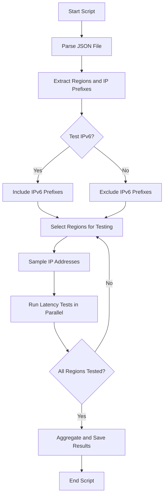

---

# Latency Testing Script

This script performs latency tests on IP addresses extracted from JSON files containing network prefixes for different cloud providers (Google Cloud, AWS, and Azure). The results are saved in a specified format (`csv` or `txt`) and can include IPv6 addresses if desired.

GCP
```bash
curl -O https://www.gstatic.com/ipranges/cloud.json
```
AWS
```bash
curl -O https://ip-ranges.amazonaws.com/ip-ranges.json
```
Azure
```bash
curl -O https://download.microsoft.com/download/7/1/D/71D86715-5596-4529-9B13-DA13A5DE5B63/ServiceTags_Public_20240826.json
```

## Table of Contents
- [Usage](#usage)
- [Features](#features)
- [Dependencies](#dependencies)
- [Installation](#installation)
- [Concurrency Diagram](#concurrency-diagram)
- [Example](#example)
- [Output](#output)
- [License](#license)

## Usage

```bash
./latency_test.sh <json_file> [--ipv6] [--output-dir <directory>] [--format <csv|txt>] [-g | -aw | -az]
```

### Options:
- `<json_file>`: The JSON file containing network prefixes for the cloud provider.
- `--ipv6`: Optionally include IPv6 addresses in the latency test.
- `--output-dir <directory>`: Specify the directory for output files. Default is `Results`.
- `--format <csv|txt>`: Specify the output format. Default is `txt`.
- `-g`: Specify Google Cloud format.
- `-aw`: Specify AWS format.
- `-az`: Specify Azure format.

### Example:
```bash
./latency_test.sh cloud_prefixes.json --ipv6 --output-dir my_results --format csv -aw
```

## Features

- **IPv6 Support**: Option to include IPv6 addresses in the latency tests.
- **Output Format**: Results can be saved in either CSV or TXT format.
- **Cloud Providers**: Supports Google Cloud, AWS, and Azure.
- **Progress Bar**: Visual progress bar during the execution of the script.
- **Parallel Execution**: Latency tests are performed in parallel to speed up the process.
- **Sampling**: The script tests a sample of IP addresses (20% or at least 3) from each region.

## Dependencies

Ensure the following tools and scripts are installed on your system:

### Required Tools:
- `jq`: For parsing JSON files.
- `gshuf`: For shuffling IP addresses and selecting samples.
- `parallel`: For running latency tests in parallel.

### Required Script:
- **`test_latency.sh`**: A helper script that pings a given IP address three times and calculates the average latency.

### `test_latency.sh` Script:
```bash
#!/bin/bash

# Function to perform latency test for a single IP address
test_latency() {
    local ip="$1"
    ping_output=$(ping -c 3 "$ip" 2>&1)
    latency=$(echo "$ping_output" | tail -1 | awk -F '/' '{print $5}')
    if [ -z "$latency" ]; then
        latency="N/A"
    fi
    echo "$ip $latency"
}

# If the script is called with an IP, test latency
if [ -n "$1" ]; then
    test_latency "$1"
fi
```

### Installation of Tools

#### On Debian/Ubuntu:
```bash
sudo apt-get install jq coreutils moreutils
```

#### On macOS:
```bash
brew install jq coreutils moreutils
```

#### For `gshuf` (if not available by default):
On macOS, `gshuf` is part of `coreutils`:
```bash
brew install coreutils
```

On Linux, `shuf` is typically available by default.

## Concurrency Diagram

The following diagram illustrates how the script handles concurrency when testing latency across multiple regions:



## Example

To run a latency test for AWS regions with IPv6 addresses and save the results in CSV format:
```bash
./latency_test.sh aws_prefixes.json --ipv6 --output-dir LatencyResults --format csv -aw
```

This command will:
- Test both IPv4 and IPv6 addresses.
- Store the results in the `LatencyResults` directory.
- Save the output in CSV format.

## Output

The script outputs latency results in the specified format (`csv` or `txt`) within the provided output directory. The output includes:
- **Region**: The cloud region tested.
- **Min Latency**: The minimum latency observed in milliseconds.
- **Max Latency**: The maximum latency observed in milliseconds.
- **Avg Latency**: The average latency observed in milliseconds.

Example of CSV output:
```csv
region,min_latency,max_latency,avg_latency
us-east-1,20.0,50.0,35.0
us-west-2,15.0,45.0,30.0
```

Example of TXT output:
```
[2024-08-28 12:00:00] Results for region: us-east-1
Min Latency: 20.0 ms
Max Latency: 50.0 ms
Avg Latency: 35.0 ms
```

## License

This script is licensed under the MIT License.

--- 
